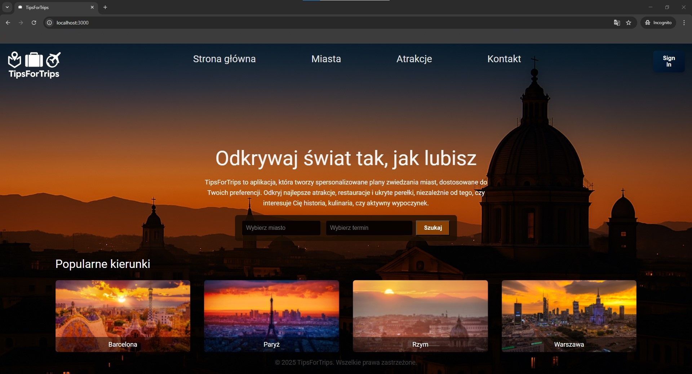
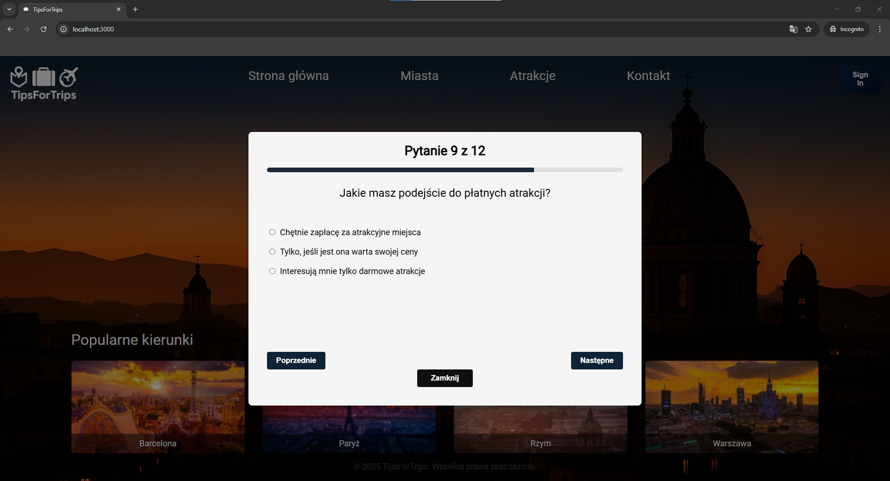
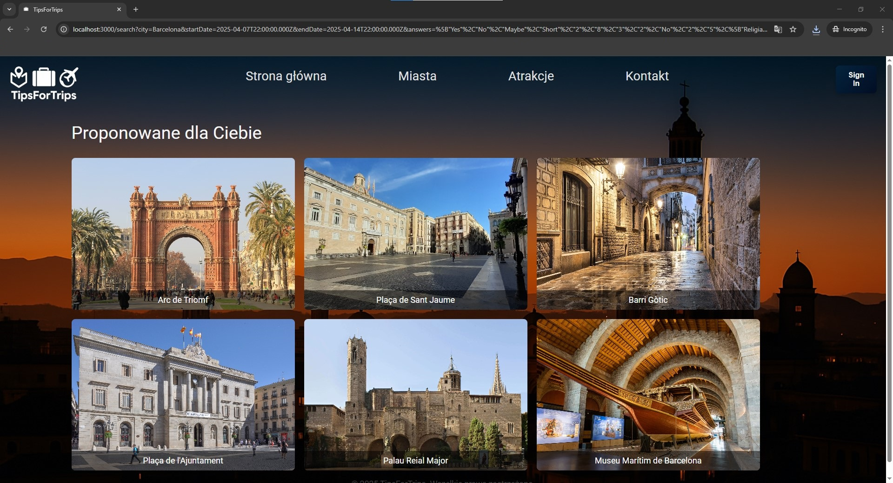
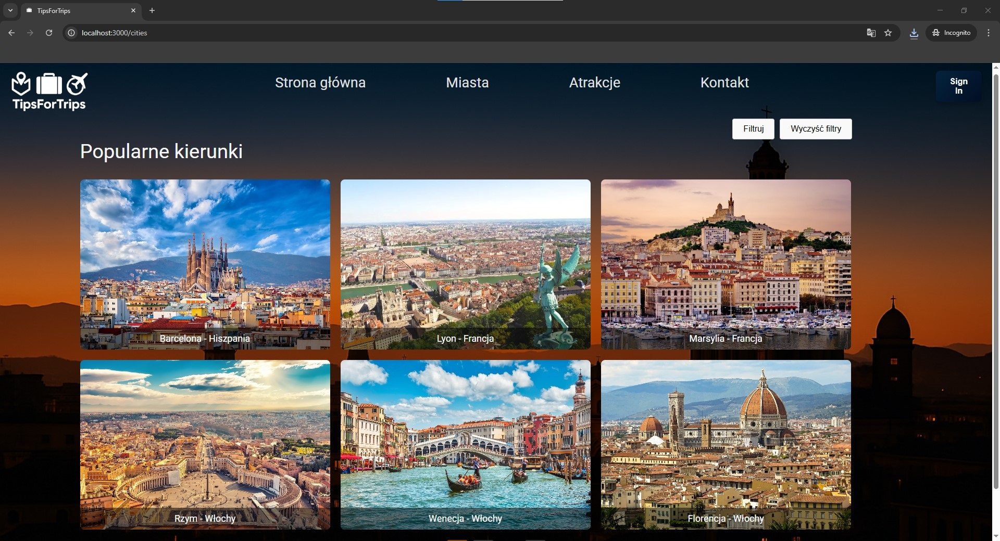

# 🧭 TipsForTrips

**TipsForTrips** to interaktywna aplikacja webowa, która pomaga użytkownikowi stworzyć **spersonalizowany plan zwiedzania**. Na podstawie krótkiej rozmowy i zadanych pytań, system rekomenduje atrakcje, które najlepiej odpowiadają preferencjom użytkownika – od muzeów i parków po przygodowe aktywności.

---

## 🌍 Funkcjonalności

✅ Interaktywna forma dialogu – użytkownik odpowiada na pytania  
✅ Dynamiczne generowanie listy atrakcji dopasowanych do preferencji  
✅ Możliwość filtrowania wyników (typy atrakcji, czas trwania, lokalizacja)  
✅ Galeria atrakcji z grafikami i opisami  
🔜 Możliwość zapisania lub wydrukowania planu podróży  
🔜 Dodanie wyszukiwania hoteli i środków transportu  
🔜 Użycie API Google Places
---

## 🖼️ Zrzuty ekranu

Poniżej kilka screenów przedstawiających działanie aplikacji:

<p align="center">
  
</p>

<p align="center">
  
</p>

<p align="center">
  
</p>

<p align="center">
  
</p>

---

## 🛠️ Technologie

**Frontend:**
- React.js
- HTML / CSS
- Interaktywne komponenty i formularze

**Backend:**
- Node.js + Express
- REST API
- Obsługa zapytań i logiki dopasowywania atrakcji

**Dane:**
- JSON / MongoDB
- Przechowywanie preferencji użytkownika

---

## 🚀 Uruchomienie lokalne

```bash
# Klonowanie repozytorium
git clone https://github.com/bskrzypczak/TipsForTrips.git
cd TipsForTrips

# Instalacja zależności backendu
cd backend
npm install

# Instalacja zależności frontendu
cd ../frontend
npm install

# Uruchomienie aplikacji (frontend + backend osobno)
npm start

# Połączenie z bazą danych!
W folderze backend, w pliku server.js należy zmienić w 10 i 11 linii wartości zmiennych 'login' i 'password' na 'test'. 
